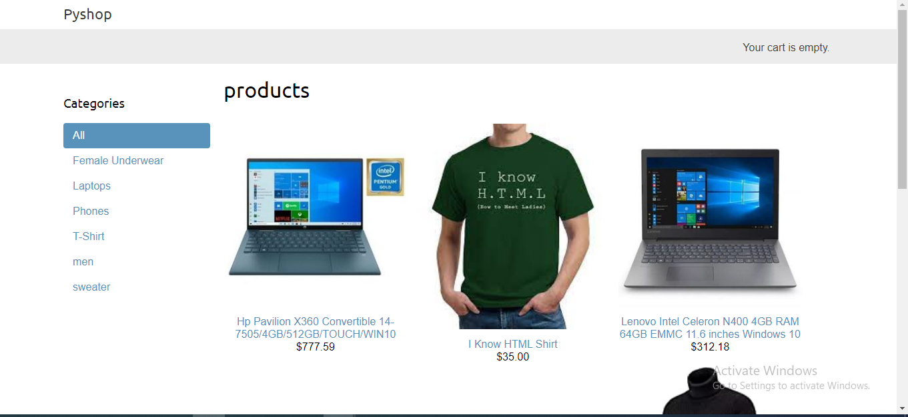
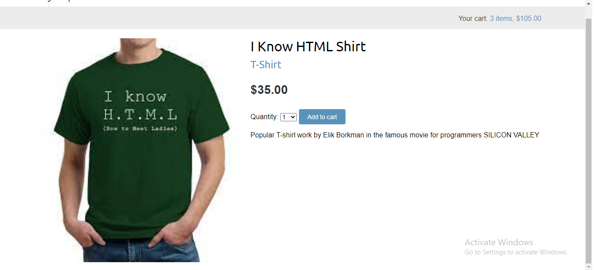
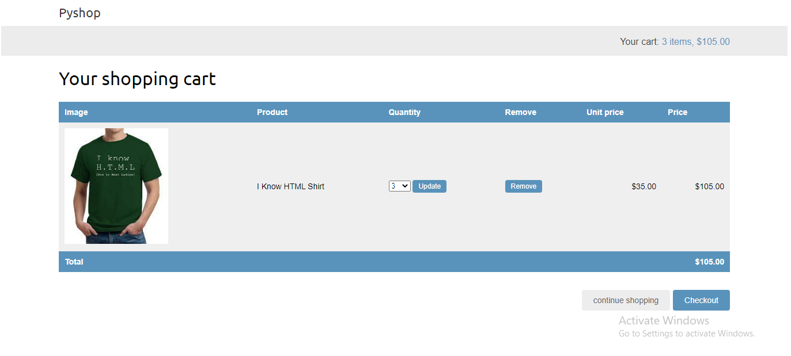
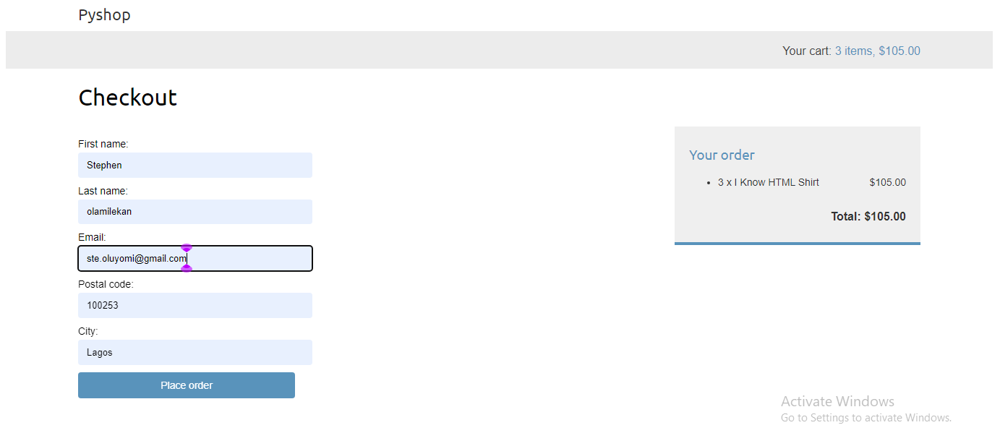

# react-dojo-blog
react-dojo-blog is a blog application coded in React. The database used is json-server. This application is used for normal blogging purposes and has the following features:-

* Create a blog post
* View a blog post
* Delete a blog post

The application is made for bloggers.

## Screenshots

## How to install and run this project
1. clone the repo
2. create virtual environment 
3. run `pip install requirements.txt`
4. run `python manage.py runserver` to start the development server